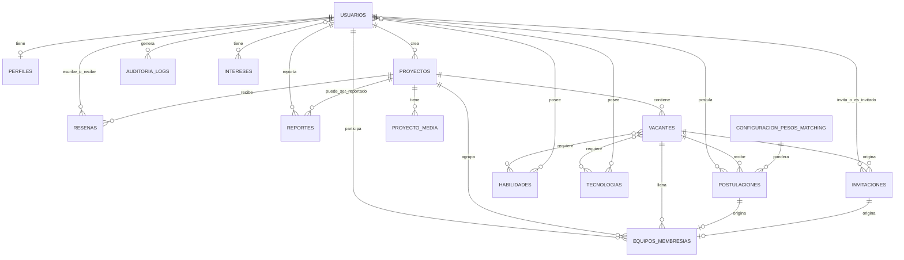

# DEVMATCH - BASE DE DATOS

Materia: Desarrollo de Software V
Ultima actualización: September 19, 2026

# Documentación de la Base de Datos — DevMatch V2.0

> Basado en `devmatch_schema_v1.sql`. Este documento explica **qué hay** en la base de datos y **cómo se comporta por dentro** (triggers, validaciones, índices), para que cualquier persona del equipo — backend, frontend, o un modelo de IA asistiendo en el código — pueda trabajar sobre los modelos ORM sin tener que leer el SQL completo primero.
> 

---

## 1. Propósito y cómo usar este documento

La base de datos no es solo un conjunto de tablas: varias reglas de negocio de la especificación técnica (cupos que nunca se exceden, transiciones de estado válidas, reseñas solo en proyectos finalizados, historial que nunca se pierde) están **garantizadas directamente por Postgres** mediante triggers y constraints, no solo por el código de Django.

Esto significa dos cosas importantes para todo el equipo:

- **Backend**: antes de escribir una validación en `services.py`, revisa la Sección 6 — es posible que la base de datos ya la esté aplicando, y tu código solo necesita capturar el error y mostrarlo de forma amigable.
- **Frontend**: la Sección 9 resume qué estados y campos existen para que sepas qué mostrar/ocultar en la interfaz sin tener que preguntarle a backend cada vez.

Si vas a pegar contexto de la base de datos a un asistente de IA para que te ayude a escribir código, este archivo completo es el contexto correcto a compartir.

---

## 2. Convenciones generales del esquema

| Convención | Detalle |
| --- | --- |
| **Nombres** | Todo en español, `snake_case`, tablas en plural (`proyectos`, `usuarios`). |
| **Claves primarias** | `id BIGINT GENERATED ALWAYS AS IDENTITY` — equivalente al `BigAutoField` que Django usa por defecto. No hace falta declarar `id` manualmente en los modelos. |
| **Fechas/horas** | Siempre `TIMESTAMPTZ` (con zona horaria), en UTC. Coincide con `USE_TZ = True` de Django. |
| **Estados** | Se implementan como `VARCHAR(N) NOT NULL DEFAULT '...' CHECK (col IN (...))`, no como ENUM nativo de Postgres. Esto es intencional: mapea 1 a 1 con `CharField(choices=...)` de Django sin necesitar librerías extra. |
| **Patrón "ocultar sin borrar" (`es_activo`)** | Cuando existe, es **independiente** de cualquier columna `estado`. `estado` cuenta la verdad histórica (ej. un proyecto llegó a `finalizado`); `es_activo` solo decide si el registro se sigue mostrando en la interfaz. Un proyecto puede estar `estado='finalizado'` y `es_activo=false` a la vez. |
| **Nunca se borra nada de verdad** | Ver Sección 6.5 y 6.6. Ni la aplicación ni un administrador pueden ejecutar un `DELETE` real sobre las tablas de historial — la base de datos lo rechaza. |
| **JSON** | Se usa `JSONB` (no `JSON` plano) para poder indexarlo y consultarlo eficientemente. Aparece en `postulaciones.match_factores` y `auditoria_logs.detalle`. |
| **Índices parciales** | Varios `UNIQUE INDEX` llevan una cláusula `WHERE` (ej. solo aplican a filas con `estado='activo'`). Esto permite que una regla de "no duplicados" conviva con el historial de filas viejas que ya cambiaron de estado. |

---

## 3. Mapa de tablas por app de Django

| App sugerida | Tablas |
| --- | --- |
| `accounts` | `usuarios`, `perfiles`, `habilidades`, `tecnologias`, `intereses`, `usuarios_habilidades`, `usuarios_tecnologias`, `usuarios_intereses` |
| `projects` | `proyectos`, `proyecto_media`, `vacantes`, `vacante_habilidades_requeridas`, `vacante_tecnologias_requeridas` |
| `matching` / `applications` | `configuracion_pesos_matching`, `postulaciones` |
| `teams` | `invitaciones`, `equipos_membresias` |
| `audit` | `auditoria_logs` |
| `reviews` | `resenas` |
| `moderation` | `reportes` |
| Django framework (`django.contrib.*`) | `django_migrations`, `django_content_type`, `django_session`, `django_admin_log`, `auth_permission`, `auth_group`, `auth_group_permissions` — infraestructura del framework, no de negocio (ver 5.8) |

---

## 4. Diagrama de relaciones



**Cómo leerlo:** una vacante nunca se llena directamente — siempre pasa primero por una `postulacion` (aceptada) o una `invitacion` (aceptada), y **de ahí** nace la fila en `equipos_membresias` que representa la membresía real en el equipo.

---

## 5. Diccionario de datos

### 5.1 App `accounts`

#### `usuarios`

Tabla de autenticación. **Nunca se borra un usuario** (ver Sección 6.5).

| Columna | Tipo | Notas |
| --- | --- | --- |
| `id` | BIGINT | PK |
| `email` | VARCHAR(254) | único |
| `username` | VARCHAR(150) | único |
| `password_hash` | VARCHAR(128) | hash de Django (PBKDF2/Argon2), no texto plano |
| `first_name`, `last_name` | VARCHAR(150) |  |
| `es_admin` | BOOLEAN | **único rol persistente**. Creador/Colaborador NO viven aquí — son contextuales (ver más abajo) |
| `es_activo` | BOOLEAN default `true` | cuenta oculta/desactivada (autoservicio o admin) |
| `esta_bloqueado` | BOOLEAN default `false` | distinto de `es_activo`: es una acción punitiva/moderación, no una ocultación voluntaria |
| `motivo_bloqueo` | TEXT | por qué se bloqueó |
| `bloqueado_en`, `bloqueado_por_id` | TIMESTAMPTZ, FK→usuarios | quién bloqueó y cuándo |
| `desactivado_en`, `desactivado_por_id` | TIMESTAMPTZ, FK→usuarios | `desactivado_por_id = NULL` implica que el propio usuario se desactivó; con valor, fue un admin |
| `ultimo_login` | TIMESTAMPTZ |  |
| `creado_en`, `actualizado_en` | TIMESTAMPTZ | `actualizado_en` se mantiene solo (ver 6.1) |

> **Importante — cómo saber si alguien es "Creador" o "Colaborador":** no son columnas de esta tabla. Un usuario es **Creador** de un proyecto si aparece como `proyectos.creador_id`; es **Colaborador** si tiene una fila en `equipos_membresias` con `estado='activo'`. El mismo usuario puede ser ambas cosas a la vez, en proyectos distintos — así lo pide la especificación.
> 

#### `perfiles`

Perfil técnico estructurado. Relación 1 a 1 con `usuarios`. **No tiene `es_activo` propio** — no existe una acción de "eliminar perfil" independiente de la cuenta.

| Columna | Tipo | Notas |
| --- | --- | --- |
| `usuario_id` | BIGINT, único, FK→usuarios (CASCADE) |  |
| `nivel` | VARCHAR(20) | `principiante` / `intermedio` / `avanzado` |
| `experiencia_anios` | SMALLINT ≥ 0 |  |
| `disponibilidad_horas_semana` | SMALLINT ≥ 0, default `10` | **numérico, no etiqueta** — así se puede calcular sobrecarga real comparando contra compromisos activos |
| `bio` | TEXT |  |
| `github_username` | VARCHAR(100) | para la integración con la API de GitHub |
| `avatar_url` | TEXT |  |

#### `habilidades`, `tecnologias`, `intereses`

Tres catálogos con **estructura idéntica**. Son los únicos, junto con las tablas puente, donde **sí se permite un `DELETE` físico real** — pero solo si nadie los está usando (protegido por `ON DELETE RESTRICT` desde las tablas puente).

| Columna | Tipo | Notas |
| --- | --- | --- |
| `nombre` | VARCHAR(100), único |  |
| `categoria` | VARCHAR(50) | (`intereses` no tiene esta columna) |
| `es_activo` | BOOLEAN default `true` | para retirar de uso sin romper referencias históricas |
| `desactivado_en`, `desactivado_por_id` |  | quién/cuándo lo desactivó (admin, panel de estandarización) |

#### `usuarios_habilidades`, `usuarios_tecnologias`, `usuarios_intereses`

Tablas puente puras (M2M). **Sin `es_activo`, sin protección de borrado**: agregar/quitar una etiqueta del perfil es edición normal, no un evento de historial.

| Columna | Tipo |
| --- | --- |
| `usuario_id` | FK→usuarios (CASCADE) |
| `habilidad_id` / `tecnologia_id` / `interes_id` | FK→catálogo (RESTRICT) |

PK compuesta `(usuario_id, catalogo_id)` — evita duplicados automáticamente.

---

### 5.2 App `projects`

#### `proyectos`

| Columna | Tipo | Notas |
| --- | --- | --- |
| `creador_id` | FK→usuarios (RESTRICT) | no se puede borrar un usuario con proyectos creados |
| `nombre`, `descripcion` | VARCHAR(150), TEXT |  |
| `estado` | VARCHAR(20) | `borrador` → `publicado` → `reclutando` → `equipo_completo` → `en_desarrollo` → `finalizado`; o `cancelado` desde casi cualquier punto. Transiciones validadas por trigger (Sección 6.3). |
| `es_activo` | BOOLEAN default `true` | **esto es lo que usa el botón "Eliminar proyecto"** de la interfaz. Ortogonal a `estado`. |
| `logo_url` | TEXT |  |
| `finalizado_en`, `cancelado_en` | TIMESTAMPTZ | se rellenan **automáticamente** por el trigger de transición, no hace falta setearlos a mano |
| `desactivado_en`, `desactivado_por_id` |  | quién ocultó el proyecto y cuándo |

Índices: por `creador_id`, por `estado`, y uno parcial `WHERE es_activo = true` (para listar rápido solo proyectos visibles).

#### `proyecto_media`

Logos y prototipos (procesados con Pillow). `tipo` es `logo` o `prototipo`; `orden` controla el orden de la galería. Tiene `es_activo` simple (sin `desactivado_por_id`, dado que es un archivo adjunto, no un registro crítico de negocio).

#### `vacantes`

| Columna | Tipo | Notas |
| --- | --- | --- |
| `proyecto_id` | FK→proyectos (CASCADE) |  |
| `titulo`, `descripcion` |  |  |
| `cupos_totales` | SMALLINT > 0 |  |
| `cupos_ocupados` | SMALLINT ≥ 0 | **mantenido automáticamente por trigger — nunca lo actualices manualmente desde Django** (ver 6.2) |
| `estado` | `abierta` / `cubierta` / `cancelada` | también automático: pasa a `cubierta` solo cuando el trigger detecta `cupos_ocupados >= cupos_totales` |
| `es_activo` | BOOLEAN | igual que en proyectos: ortogonal a `estado` |

Constraint: `cupos_ocupados <= cupos_totales` — es la última red de seguridad contra sobrecupo, aunque el trigger de la Sección 6.2 ya lo previene con bloqueo de fila.

#### `vacante_habilidades_requeridas`, `vacante_tecnologias_requeridas`

Tablas puente M2M entre `vacantes` y los catálogos. Edición libre (sin protección de borrado) — son la definición *actual* de requisitos de la vacante; lo que se usó *en el momento de cada postulación* ya quedó congelado aparte en `postulaciones.match_factores`.

---

### 5.3 Apps `matching` / `applications`

#### `configuracion_pesos_matching`

| Columna | Tipo | Notas |
| --- | --- | --- |
| `peso_habilidades`, `peso_nivel`, `peso_tecnologias`, `peso_experiencia`, `peso_disponibilidad` | NUMERIC(4,3) | deben sumar exactamente `1.000` (constraint `chk_pesos_suman_uno`) |
| `es_activo` | BOOLEAN | ⚠️ **significado distinto al resto del esquema**: aquí indica "es el perfil de pesos vigente ahora mismo" (patrón singleton — solo puede haber un `true` a la vez, forzado por un índice único parcial), no "no está borrado". |
| `vigente_desde`, `vigente_hasta` | TIMESTAMPTZ |  |

CR-06 pospuso que el Creador ajuste los pesos por vacante — esta tabla ya está versionada y lista para esa función futura sin requerir cambios estructurales. Por ahora hay un único registro sembrado: **Ponderación estándar v1.0** (0.35 / 0.15 / 0.30 / 0.10 / 0.10).

Una vez que un peso se usó en alguna postulación, **no puede eliminarse** (`ON DELETE RESTRICT` desde `postulaciones.pesos_usados_id`) — perdería la explicabilidad histórica.

#### `postulaciones`

La tabla más "cargada" de reglas de negocio.

| Columna | Tipo | Notas |
| --- | --- | --- |
| `vacante_id` | FK→vacantes (CASCADE) |  |
| `postulante_id` | FK→usuarios (RESTRICT) |  |
| `estado` | `pendiente` / `preseleccionada` / `aceptada` / `rechazada` / `retirada` |  |
| `match_score` | NUMERIC(5,2), 0–100 |  |
| `match_factores` | JSONB | **snapshot congelado** del desglose del Match Score en el instante exacto de la postulación (CR-07). Nunca se recalcula, ni siquiera si el perfil del usuario cambia después (CR-12). |
| `pesos_usados_id` | FK→configuracion_pesos_matching (RESTRICT) | qué ponderación se usó para ese cálculo, para poder explicarlo años después |
| `decidido_por_id`, `motivo_decision`, `decidido_en` |  | quién aceptó/rechazó y por qué |

**No tiene `es_activo`**: el estado `retirada` ya cumple exactamente esa función — conserva el historial completo (regla no negociable de la especificación) sin necesitar una columna adicional.

Índice único parcial `ux_postulacion_activa_unica` sobre `(vacante_id, postulante_id)` **solo cuando `estado IN ('pendiente','preseleccionada')`** — es la garantía real (no solo de aplicación) de que nadie puede tener dos postulaciones activas a la misma vacante, sin bloquear que alguien vuelva a postularse después de una retirada o rechazo.

---

### 5.4 App `teams`

#### `invitaciones`

| Columna | Notas |
| --- | --- |
| `vacante_id`, `usuario_invitado_id`, `invitado_por_id` | quién invita a quién, a qué vacante |
| `estado` | `pendiente` / `aceptada` / `rechazada` / `ignorada` |

Sin `es_activo`: los estados terminales ya conservan el historial. Índice único parcial evita más de una invitación `pendiente` simultánea a la misma persona para la misma vacante.

#### `equipos_membresias`

La tabla que representa "quién es parte del equipo, de verdad".

| Columna | Notas |
| --- | --- |
| `proyecto_id`, `vacante_id`, `usuario_id` |  |
| `postulacion_id` **XOR** `invitacion_id` | exactamente una de las dos debe tener valor (constraint `chk_origen_membresia`) — toda membresía nace de una postulación aceptada o de una invitación aceptada, nunca de la nada |
| `estado` | `activo` / `retirado` |
| `ingreso_en`, `retiro_en` |  |

**Un usuario retirado nunca se borra de aquí** — solo cambia a `estado='retirado'`. `estado` ya cumple aquí el rol de `es_activo`.

⚠️ **El Creador del proyecto NO aparece en esta tabla** (no llena una vacante). Si necesitas comprobar "¿esta persona es parte real del proyecto?", revisa **ambas** cosas: `equipos_membresias` (colaboradores) y `proyectos.creador_id` (el líder). El trigger de reseñas (6.4) ya hace esta doble verificación — replica la misma lógica en tu código de Django si la necesitas en otro lugar.

---

### 5.5 App `audit`

#### `auditoria_logs`

| Columna | Notas |
| --- | --- |
| `usuario_id` | quién hizo la acción (puede ser `NULL` si el usuario luego se desactivó, `SET NULL`) |
| `accion` | texto libre, ej. `"proyecto.desactivado"`, `"postulacion.aceptada"` |
| `tabla_afectada`, `registro_id` | a qué tabla/fila se refiere (no es una FK real porque apunta a tablas distintas — es responsabilidad de la app escribir el nombre correcto) |
| `detalle` | JSONB libre para contexto adicional |

**Tabla de solo-append.** Ni `UPDATE` ni `DELETE` están permitidos, ni siquiera para un admin (Sección 6.6). Se escribe explícitamente desde `audit/services.py` en cada decisión crítica — **incluyendo cada vez que algo se marca `es_activo=false`**. Esto no es automático a nivel de base de datos; es responsabilidad del código de Django llamarlo.

---

### 5.6 App `reviews`

#### `resenas`

| Columna | Notas |
| --- | --- |
| `proyecto_id`, `autor_id`, `destinatario_id` |  |
| `calificacion` | SMALLINT 1–5 |
| `comentario` | TEXT |
| `es_activo` | permite a un admin ocultar una reseña reportada/ofensiva sin borrar la evidencia |

Constraints: `autor_id <> destinatario_id` (no autoreseñas), y `UNIQUE(proyecto_id, autor_id, destinatario_id)` (no se puede reseñar dos veces a la misma persona en el mismo proyecto).

El `INSERT` está protegido por el trigger `trg_validar_resena` (Sección 6.4): rechaza la reseña si el proyecto no está `finalizado`, o si autor/destinatario no fueron miembros reales.

---

### 5.7 App `moderation`

#### `reportes`

| Columna | Notas |
| --- | --- |
| `reportante_id` | quién reporta (puede ser `NULL` si se desactivó después) |
| `tipo_objetivo` | `proyecto` / `perfil` / `conducta` |
| `proyecto_reportado_id` **XOR** `usuario_reportado_id` | exactamente uno de los dos, según `tipo_objetivo` (constraint `chk_objetivo_reporte`) — **no** es una referencia polimórfica genérica, son dos FKs reales con integridad referencial completa |
| `motivo`, `descripcion` |  |
| `estado` | `pendiente` / `en_revision` / `resuelto` / `descartado` |
| `decision`, `resuelto_por_id`, `resuelto_en` |  |

Sin `es_activo`: `descartado` ya cumple esa función. Sí está en la lista de tablas con `DELETE` bloqueado (un reporte resuelto es evidencia de una decisión de moderación).

### 5.8 Tablas de infraestructura de Django (framework)

Cuando se ejecuta `python manage.py migrate`, Django crea **siete tablas propias** que **no viven en `devmatch_schema_v1.sql`**: son infraestructura del framework, no tablas de negocio. No se tocan a mano, no se incluyen en fixtures de negocio, y las consultas del proyecto no deben referenciarlas directamente.

| Tabla | Rol en el framework |
| --- | --- |
| `django_migrations` | registro de qué migraciones están aplicadas; si se pierde, `migrate` cree que no hay nada aplicado |
| `django_content_type` | registro de cada modelo ("app + modelo"); base de los permisos y del log del admin |
| `django_session` | sesiones HTTP del lado servidor |
| `django_admin_log` | histórico de acciones del panel `/admin` |
| `auth_permission` | catálogo `app.codename` de permisos de Django |
| `auth_group`, `auth_group_permissions` | grupos de usuarios y su relación con permisos |

**Relación con el usuario custom:** como el proyecto declara `AUTH_USER_MODEL = "accounts.Usuario"` en `config/settings/base.py`, Django **no crea** `auth_user`, `auth_user_groups` ni `auth_user_user_permissions`. La autenticación real sigue viviendo en `usuarios`, y el FK de `django_admin_log.user_id` apunta a `usuarios.id`.

---

## 6. Funciones y triggers — el "cerebro" de la base de datos

Esta sección es la más importante para backend: explica comportamientos que ocurren **solos**, sin que tu código de Django tenga que pedirlos.

### 6.1 `fn_set_updated_at` — mantenimiento de `actualizado_en`

Se dispara `BEFORE UPDATE` en `usuarios`, `perfiles`, `proyectos`, `vacantes` y `postulaciones`. Simplemente pone `actualizado_en = now()` en cada `UPDATE`.

**Para tu código:** nunca asignes `actualizado_en` manualmente en un `save()` de Django — se sobreescribe solo, y si tu modelo usa `auto_now=True` en ese campo estarás duplicando trabajo (ambos harían lo mismo; no hay conflicto, pero es redundante).

### 6.2 `fn_actualizar_cupos_vacante` — cupos a prueba de condiciones de carrera

Se dispara `AFTER INSERT/UPDATE(estado)/DELETE` en `equipos_membresias`. Hace tres cosas, en este orden:

1. **Bloquea la fila de la vacante** (`SELECT ... FOR UPDATE`) — si dos aceptaciones llegan al mismo tiempo para la misma vacante, la segunda literalmente espera a que la primera termine.
2. Recalcula `cupos_ocupados` contando membresías con `estado='activo'`.
3. Actualiza `vacantes.estado`: pasa a `cubierta` si se llenó, vuelve a `abierta` si se liberó un cupo (por ejemplo, alguien se retiró).

**Para tu código:** cuando aceptes una postulación o invitación, tu única responsabilidad es hacer el `INSERT` en `equipos_membresias` dentro de una transacción — **no** actualices `cupos_ocupados` ni `vacantes.estado` a mano, el trigger ya lo hace, y hacerlo tú también podría generar una condición de carrera real (dos escrituras compitiendo). Si tu `INSERT` intenta exceder el cupo, Postgres lo rechaza (ver constraint `chk_cupos_no_exceden`) — captura ese error en tu vista y muéstralo como "esta vacante ya se llenó".

### 6.3 `fn_validar_transicion_proyecto` — máquina de estados del proyecto

Se dispara `BEFORE UPDATE OF estado` en `proyectos`. Rechaza cualquier transición que no esté en esta tabla:

| Desde | Puede pasar a |
| --- | --- |
| `borrador` | `publicado`, `cancelado` |
| `publicado` | `reclutando`, `cancelado` |
| `reclutando` | `equipo_completo`, `cancelado` |
| `equipo_completo` | `en_desarrollo`, `reclutando`, `cancelado` |
| `en_desarrollo` | `finalizado`, `cancelado` |
| `finalizado` | *(ninguno — estado terminal)* |
| `cancelado` | *(ninguno — estado terminal)* |

Además, rellena automáticamente `finalizado_en` o `cancelado_en` según corresponda.

**Para tu código:** esto es una **salvaguarda adicional**, no un reemplazo de la validación en `projects/services.py`. Implementa la misma lógica (o una más matizada, con mensajes de error específicos) en Django, porque ahí es donde le muestras al usuario un mensaje amigable — este trigger solo existe para que, pase lo que pase en el código de la aplicación, una transición inválida sea **imposible de persistir**. Si algo se te escapa en Django, el trigger lo detendrá con un `IntegrityError`/`OperationalError` que debes capturar.

### 6.4 `fn_validar_resena` — reseñas verificadas

Se dispara `BEFORE INSERT` en `resenas`. Verifica dos cosas antes de permitir la fila:

1. Que `proyectos.estado = 'finalizado'`.
2. Que tanto `autor_id` como `destinatario_id` fueron miembros reales del proyecto — entendiendo "miembro real" como: tiene una fila en `equipos_membresias` para ese proyecto, **o** es el `creador_id` del proyecto.

**Para tu código:** replica este mismo chequeo en el formulario de Django antes de mostrar el botón "Dejar reseña" (para no confundir al usuario con un error del servidor), pero confía en que el trigger es la garantía final.

### 6.5 `fn_prevenir_borrado_fisico` — bloqueo de `DELETE` en tablas de historial

Se dispara `BEFORE DELETE` en: `usuarios`, `perfiles`, `proyectos`, `proyecto_media`, `vacantes`, `postulaciones`, `invitaciones`, `equipos_membresias`, `resenas`, `reportes`.

Cualquier intento de `DELETE` sobre estas tablas — **desde cualquier rol de la aplicación, incluido un administrador** — falla con este error:

```
Eliminación física no permitida en "<tabla>". Use la columna es_activo/estado
correspondiente para ocultar el registro. Un borrado real solo es posible
deshabilitando este trigger manualmente desde la base de datos.
```

**No se aplica** (a propósito) a: los catálogos (`habilidades`, `tecnologias`, `intereses` — pueden borrarse si nadie los usa), las tablas puente (`usuarios_habilidades`, etc. — editar una asociación es normal), y `configuracion_pesos_matching` (ya protegida de otra forma, ver 5.3).

**Para tu código:** en Django, esto significa que **nunca debes exponer `.delete()`** sobre estos modelos desde una vista o un endpoint — ni siquiera detrás de un permiso de administrador. La acción "Eliminar" en la interfaz debe traducirse siempre a un `UPDATE` que ponga `es_activo=false` (o el `estado` terminal correspondiente cuando no exista `es_activo`), más un registro en `auditoria_logs`. Si algún código intentara un `.delete()` real, Postgres lo rechazará con una excepción — trátalo como un bug a corregir, no como algo que debas capturar y ocultar.

### 6.6 `fn_inmutable_auditoria` — inmutabilidad total del log de auditoría

Se dispara `BEFORE UPDATE OR DELETE` en `auditoria_logs` — más estricto que el resto, porque aquí se bloquea **también el `UPDATE`**, no solo el `DELETE`. Un log de auditoría que se puede editar retroactivamente ya no sirve como auditoría.

**Para tu código:** el modelo de Django para esta tabla solo debería usarse para `create()`. Nunca para `update()` ni `delete()`.

---

## 7. Qué garantiza la base de datos vs. qué debe garantizar Django

| Regla de negocio | ¿Dónde está garantizada? |
| --- | --- |
| Nadie tiene dos postulaciones activas a la misma vacante | ✅ Base de datos (índice único parcial) — Django solo necesita mostrar el error bonito |
| Una vacante nunca supera su cupo, incluso con aceptaciones simultáneas | ✅ Base de datos (trigger + `FOR UPDATE` + constraint) |
| Un proyecto no puede saltar de `borrador` a `finalizado` | ✅ Base de datos (trigger), pero **replica la validación en Django** para dar mensajes de error específicos por transición |
| Solo miembros reales de un proyecto Finalizado pueden reseñarse | ✅ Base de datos (trigger) |
| Nada se borra físicamente en tablas de historial | ✅ Base de datos (trigger de bloqueo) |
| El log de auditoría es inmutable | ✅ Base de datos (trigger) |
| Validación de roles y permisos en la interfaz Y en el servidor | ⚠️ Responsabilidad de Django (`accounts/permissions.py`, mixins) — la base de datos no sabe qué rol tiene la sesión HTTP actual |
| Un proyecto en `Borrador` no debe ser visible para recibir postulaciones | ⚠️ Responsabilidad de Django (filtro en las vistas/queries) — la base de datos no impide insertar una postulación a una vacante de un proyecto en borrador, solo bloquea el sobrecupo y los duplicados |
| Registrar cada decisión crítica en `auditoria_logs` | ⚠️ Responsabilidad de Django (`audit/services.py: log_action(...)`) — no ocurre automáticamente vía trigger, porque la base de datos no tiene acceso directo al usuario autenticado de la sesión HTTP sin plumbing adicional |
| Prevención de carga (disponibilidad vs. proyectos activos) | ⚠️ Responsabilidad de Django — la base de datos solo almacena `disponibilidad_horas_semana`; el cálculo de sobrecarga comparando contra membresías activas es lógica de aplicación |

---

## 8. Recetario: flujos comunes paso a paso

### 8.1 Publicar un proyecto con una vacante

```
1. INSERT proyectos (estado='borrador', creador_id=...)
2. UPDATE proyectos SET estado='publicado' WHERE id=... (el trigger 6.3 valida la transición)
3. UPDATE proyectos SET estado='reclutando' WHERE id=...
4. INSERT vacantes (proyecto_id=..., cupos_totales=N)
5. INSERT vacante_habilidades_requeridas / vacante_tecnologias_requeridas
6. (Django) audit/services.py: log_action("proyecto.publicado", ...)
```

### 8.2 Un colaborador se postula (evitando duplicados)

```
1. Calcular match_score y match_factores en Python (matching/engine.py)
2. INSERT postulaciones (vacante_id, postulante_id, match_score, match_factores,
                          pesos_usados_id=<el es_activo=true actual>)
   → si ya existe una postulación pendiente/preseleccionada para el mismo
     (vacante_id, postulante_id), Postgres rechaza el INSERT (índice único parcial).
     Captura ese error y muestra "ya tienes una postulación activa a esta vacante".
```

### 8.3 Aceptar una postulación (transacción completa)

```
BEGIN;
  UPDATE postulaciones SET estado='aceptada', decidido_por_id=..., decidido_en=now()
    WHERE id = <postulacion_id>;

  INSERT INTO equipos_membresias (proyecto_id, vacante_id, usuario_id, postulacion_id)
    VALUES (...);
    -- el trigger 6.2 recalcula cupos_ocupados y el estado de la vacante SOLO;
    -- si ya no había cupo, este INSERT falla por el constraint chk_cupos_no_exceden
    -- y toda la transacción se revierte (ninguno de los dos UPDATE/INSERT queda aplicado).
COMMIT;

(Django) audit/services.py: log_action("postulacion.aceptada", ...)
```

> Envuelve siempre estos dos pasos en una única transacción de Django (`transaction.atomic()`), para que si el `INSERT` en `equipos_membresias` falla por falta de cupo, el `UPDATE` de la postulación también se revierta — de lo contrario quedaría una postulación marcada "aceptada" sin membresía real.
> 

### 8.4 Retirar a un miembro del equipo

```
UPDATE equipos_membresias SET estado='retirado', retiro_en=now() WHERE id=...
  → el trigger 6.2 recalcula cupos_ocupados (baja) y puede reabrir la vacante
    (estado vuelve a 'abierta' si estaba 'cubierta').
```

### 8.5 "Eliminar" (ocultar) un proyecto, vacante o reseña

```
UPDATE proyectos SET es_activo=false, desactivado_en=now(), desactivado_por_id=<usuario_actual>
  WHERE id=...;

(Django) audit/services.py: log_action("proyecto.desactivado", ...)
```

Nunca uses `.delete()`. Si lo intentas, el trigger 6.5 lo rechazará.

### 8.6 Verificar si un usuario es "miembro real" de un proyecto

```sql
SELECT EXISTS (
    SELECT 1 FROM equipos_membresias WHERE proyecto_id = %s AND usuario_id = %s
    UNION
    SELECT 1 FROM proyectos WHERE id = %s AND creador_id = %s
);
```

Esta es exactamente la lógica que ya usa el trigger de reseñas (6.4) — replícala en Django (por ejemplo como un método `Proyecto.es_miembro_real(usuario)`) para reutilizarla en otras validaciones (ej. mostrar el botón "Dejar reseña" solo si aplica).

---

## 9. Guía rápida para Frontend

### Estados y qué comunican

| Campo | Valores | Sugerencia de UI |
| --- | --- | --- |
| `proyectos.estado` | `borrador`, `publicado`, `reclutando`, `equipo_completo`, `en_desarrollo`, `finalizado`, `cancelado` | badge de color por estado; un proyecto en `borrador` nunca debería listarse fuera del panel del propio creador |
| `vacantes.estado` | `abierta`, `cubierta`, `cancelada` | deshabilita el botón "Postularme" si no es `abierta` |
| `postulaciones.estado` | `pendiente`, `preseleccionada`, `aceptada`, `rechazada`, `retirada` | en "Mis Postulaciones", permite "Retirar" solo si es `pendiente` o `preseleccionada` |
| `invitaciones.estado` | `pendiente`, `aceptada`, `rechazada`, `ignorada` | notificación con botones Aceptar/Rechazar solo si `pendiente` |
| `equipos_membresias.estado` | `activo`, `retirado` | en la vista de equipo, muestra solo `activo`; opcionalmente un historial aparte con `retirado` |
| `reportes.estado` | `pendiente`, `en_revision`, `resuelto`, `descartado` | panel de admin, filtro por estado |

### Campos `es_activo` — qué significa para la interfaz

Cualquier listado normal (dashboard del usuario, exploración pública de proyectos, etc.) debe filtrar siempre `WHERE es_activo = true` en `proyectos`, `vacantes` y `resenas`. Si necesitas mostrar "proyectos archivados" en algún panel especial, ahí es donde consultarías explícitamente `es_activo = false`.

### Forma del `match_factores` (JSON)

Aunque el motor de matching lo define en detalle, la forma esperada para pintar la barra de progreso y el desglose es:

```json
{
  "habilidades":     { "score": 82, "peso": 0.35 },
  "nivel":           { "score": 70, "peso": 0.15 },
  "tecnologias":     { "score": 90, "peso": 0.30 },
  "experiencia":     { "score": 60, "peso": 0.10 },
  "disponibilidad":  { "score": 100, "peso": 0.10 }
}
```

(Confirma el formato exacto con quien implemente `matching/engine.py` en la Etapa 2 — esta es la estructura de referencia sobre la que se diseñó la columna JSONB.)

---

## 10. Apéndice: valores permitidos por columna

Referencia rápida de todos los `CHECK ... IN (...)` del esquema, para poblar `choices=` en Django o `<select>` en el frontend sin ir a buscar el SQL:

```
usuarios.es_admin              → boolean
usuarios.es_activo             → boolean
usuarios.esta_bloqueado        → boolean

perfiles.nivel                 → principiante | intermedio | avanzado

proyectos.estado               → borrador | publicado | reclutando | equipo_completo
                                  | en_desarrollo | finalizado | cancelado
proyectos.es_activo            → boolean

proyecto_media.tipo            → logo | prototipo

vacantes.estado                → abierta | cubierta | cancelada
vacantes.es_activo             → boolean

postulaciones.estado           → pendiente | preseleccionada | aceptada
                                  | rechazada | retirada

invitaciones.estado            → pendiente | aceptada | rechazada | ignorada

equipos_membresias.estado      → activo | retirado

resenas.calificacion           → entero 1 a 5
resenas.es_activo              → boolean

reportes.tipo_objetivo         → proyecto | perfil | conducta
reportes.estado                → pendiente | en_revision | resuelto | descartado

configuracion_pesos_matching.es_activo → boolean (singleton: solo uno true a la vez)
```